# Advanced CSS Course - Udemy

<span>
   
   
</span>

<div>
   
</div>

#### *Table of Contents :*

------

1. [Natours Project   Setup and First Steps (Part 1)](#natours-project-setup-and-first-steps-part-1)
2. [How CSS Works_ A Look Behind the Scenes](#how-css-works_-a-look-behind-the-scenes)
3. [Introduction to Sass and NPM](#introduction-to-sass-and-npm)
4. [Natours Project Using Advanced CSS and Sass (Part 2)](#Natours Project  Using Advanced CSS and Sass (Part 2))
5. Natours Project Advanced Responsive Design (Part 3)
6. Trillo Project Master Flexbox!
7. A Quick Introduction To CSS Grid Layouts
8. NEXTER PROJECT - MASTER CSS GRID LAYOUT


## **Natours Project Setup and First Steps (Part 1)**

1. ##### *Build The Header Part 1*

   We want to build The Showcase Website Background 

   *Lecture :*

   * A basic reset using the "Universal Selector". 

   * How to project-wide font definitions.

   * How to clip 

     

   #### **Summary**

   ------

   `box-sizing : border-box;` --> change the box model so that borders and the padding no longer added to the total width or total height of the box.

    `background-size: cover;` --> If you resize the browser, the background image still to cover the entire viewport browser / container.

    `linear-gradient()` --> gradients let you display smooth transitions between two or more specified colors.

    `clip-path` --> creates a clipping region that sets what part of an element should be shown. [1](https://developer.mozilla.org/en-US/docs/Web/CSS/clip-path)

    `polygon()` --> The format is `polygon(x1 y1, x2 y2, ...)` where you specify pairs of x y coordinates for each vertex (point) of a polygon. [1](https://www.html5rocks.com/en/tutorials/shapes/getting-started/) [2](https://bennettfeely.com/clippy/)

   

2. ***Building the Header - Part 2***

   Building Heading Website into the center of the showcase.

   *Lecture :*

   * Center anything with the transform, top, left properties.

   

   #### **Summary**

   ------

   `text-transform` --> property controls the capitalization of text.

   **block level element** -- > create line breaks after and before elements

   `translate()` --> function repositions an element in the horizontal and/or vertical directions. [1](https://developer.mozilla.org/en-US/docs/Web/CSS/transform-function/translate)

3. ##### Creating Cool CSS Animations

   This section we want to animating the Heading 

   *Lecture :*

   * How to create CSS animations using `@keyframes` and `animation` property

     

   #### Summary

   ------

   translateX()` --> repositions the element to the X-Axis 

   `faceback-visibility` --> property defines whether or not the back face of an element should be visible when facing the user. The back face of an element is a mirror image of the front face being displayed. [1](https://www.w3schools.com/cssref/css3_pr_backface-visibility.asp)

   

4. #### Building a Complex Animated Button - Part 1

   Build a button with animation Part 1 in bottom of the header Website

   *Lecture :*

   * pseudo-elements and pseudo-classes
   * How and Why to use the `::after` pseudo-element
   * Create a creative hover animation effect using the `transition` property.

   `box-shadow` --> Make shadow an element. The format is (X-Axis | Y-Axis | blurred | color)

   `pseudo-classes` --> special state of a selector  

   Example : 

   `.btn:link; /* for unvisited link */`

   `.btn:active; /* When we click the element */`

   

5. #### Building a Complex Animated Button - Part 1

   Build a button with animation Part 2 in bottom of the header Website

   

   #### Summary

   ------

   `::after` --> creates a pseudo-element that is the last child of the selected element.

   

##  How CSS Works_ A Look Behind the Scenes

1. #### Three Pillars of Writing Good HTML and CSS 

   1. ##### Responsive Design

      * Fluid Layouts
      * Media Queries
      * Responsive Image
      * Correct Units 
      * Desktop-first vs mobile-first

   2. ##### Maintanable and Scalable Code

      * Clean
      * Easy to Understand 
      * Growth
      * Reusable
      * How to Organize File
      * How to name classes
      * How to Structure HTML

   3. ##### Web Performance

      * Less HTTP Requests

      * Less Code

      * Compress Code

      * Use a CSS Preprocessor

      * Less Images

      * Compress Images

         

2. #### How CSS Works Behind the Scenes_ An Overview

   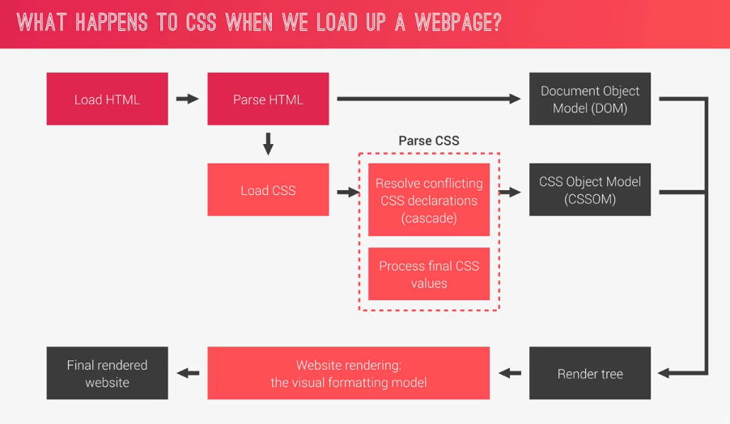

   Other Reference : [MDN Mozilla](https://developer.mozilla.org/en-US/docs/Learn/CSS/Introduction_to_CSS/How_CSS_works)

   

3. #### How CSS is Parsed_ Part 1_ The Cascade and Specificity

   `Cascade` -->  Process of combining different stylesheet and resolving conflicts between different CSS rules and declarations, when more than one rule applies to a certain element.

   `Cascade Resolve Conflicts` : 

   1. ##### Importance

      * using `!important` declarations

   2. ##### Specificity (Highest Priority) based on Selector below

      1. Inline Styles
      2. IDs
      3. Classes, Pseudo-classes, attribute
      4. Elements, pseudo-elements

      **Example :** 

      ```css
      .button {
          font-size: 20px;
          color: white;
          background-color: blue;
      }
      
      nav#nav div.pull-right .button {
          background-color: green;
      }
      
      a {
          background-color: purple;
      }
      
      #nav a.button:hover {
          background-color: yellow;
      }
      ```

      | Inline | IDs  | Classes | Elements |
      | :----: | :--: | :-----: | :------: |
      |   0    |  0   |    1    |    0     |
      |   0    |  1   |    2    |    2     |
      |   0    |  0   |    0    |    1     |
      |   0    |  1   |    2    |    1     |

        The selector number 2 is **the most specific** of all.

   3. ##### Source Order

      The last declaration in the code will override all other declarations and will be applied

4. #### How CSS is Parsed_ Part 2_ Value Processing

   * Units measurement in CSS be converted to Pixel.

   * `Initial Value` --> the default value if there are no cascaded values.

   * `font-size` in every browser has a value of 16px (default).

   * Percentages (**%**) is not Unit element.

   * relative unit always relative to the root font-size. Ex: 1.5rem for section and for the root 16px. So calculate it like this.
     $$
     1.5rem * 16px = 24px
     $$
     

   ##### How Units are Converted form Relative to Absolute (PX)

   *This convertion is used for build more requrest responsive Layouts*

   Example :

   ```css
   html, body {
       font-size: 16px;
       width: 80vw;
   }
   
   header {
       font-size: 150%;
       padding: 2em;
       margin-bottom: 10rem;
       height: 90vh;
       width: 1000px;
   }
   
   .header-child {
       font-size: 3em;
       padding: 10%:
   }
   ```

    

   | #           | Example | How to Convert to Pixels              | Result in Pixels                   |
   | :---------- | :-----: | :------------------------------------ | :--------------------------------- |
   | $fonts      |  150%   | x% + parent's computed **fonts-size** | 24px (150% + 16px) (**parent**)    |
   | $(lengths)  |   10%   | x% + parent's computed **width**      | 100px  (10% + 1000px)              |
   | em (font)   |   3em   | x * parent                            | 72px (3 * 24px)                    |
   | em (length) |   2em   | x * current element                   | 48px (2 * 24px)                    |
   | rem         |  10rem  | x * root                              | 160px (10rem * 16px)               |
   | vh          |  90vh   | x * 1% of viewport height             | 90% of the current viewport height |
   | vw          |  90vw   | x * 1% of viewport width              | 90% of he current viewport width   |

   $(length) -->  using parent element as reference 

   em (font-size) --> using parent element as reference

   em (length) --> using current element as reference 

   rem --> using root element as reference

5. #### How CSS is Parsed_ Part 3_ Inheritance

   `Inheritance` is a way propagating property value from parent element to their children

   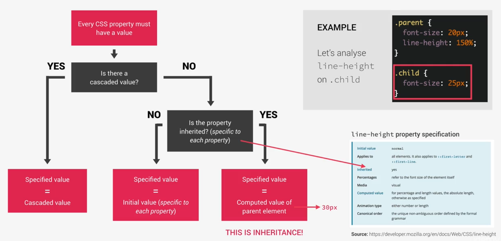

   

6. #### Converting px to rem_ An Effective Workflow

   *Lecture :*

   * Why use rem unit in every project;

   * A great workflow for converting px to rem.

   ```css
   * {
       margin: 0;
       padding: 0;
       box-sizing: inherit;
   }
   
   html {
    	/* 10px / 16px (default font-size) */   
       font-size: 62.5%;
   }
   
   body {
       font-family: "Lato", sans-serif;
       font-weight: 400;
       line-height: 1.7;
       color: #777;
       padding: 3rem;
       
       box-sizing: border-box;
   }
   ```

   The box Sizing Property by itself is not inherited, but by setting the box-sizing property on each and  every element on the entire page to inherit, it will automatically inherit whatever we put anywhere. 

7. #### How CSS Renders a Website_ The Visual Formatting Model

   Algorithm that calculates boxes and determines the layout of these boxes, for each element in the render tree, in order to determine the final layout of the page.

   1. ##### The Box Model

      Can be seen as a rectangle box, there are width, length, padding, margins, border.

      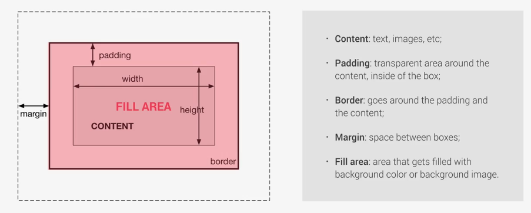

      **Heights and Widths Box Model**

      ------

      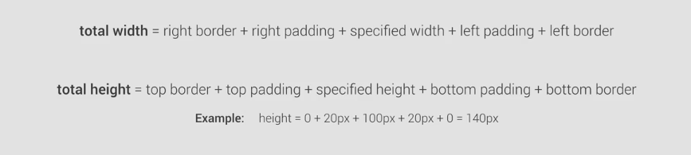

   2. ##### Box Types: Inline, Block-Level and Inline-Block

      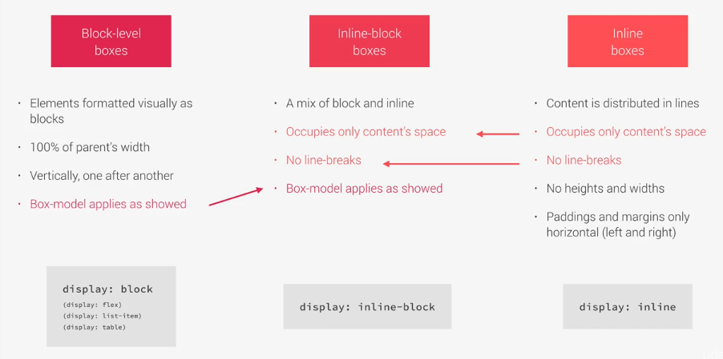

   3. ##### Positioning Schemes

      1. Normal Flow

         *  Default positioning scheme

         * **Not** Floated

         * **Not** Absolute Positioned

         * Elements laid out according to their source code

           ```css
           /* Default */
           position: relative;
           ```

      2. Floats

         * **Element is removed from the Normal Flow**

         * Text and inline-element will wrap around the floated element

         * The container will not adjust its height to the element

           ```css
           float: left;
           float: right;
           ```

      3. Absolute Positioning

         * **Element is removed from the Normal Flow**

         * No impact on surrounding content ot elements

         * We use top, bottom, left, and right to offset the element from its relatively positioned container.

           ```css
           position: absolute;
           position: fixed;
           ```

      4. Stacking context

         Determine in which order element are rendered on the page. Using `z-index`.

         The higher `z-index` appears on top and vice versa. Not only `z-index` that create stacking context but also `opacity`, etc.

         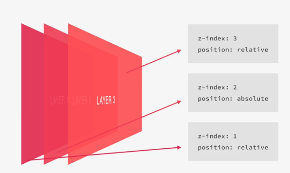

8. #### CSS Architecture_ Components and BEM

   ##### The Think - Build - Architect Mindset

   ------

   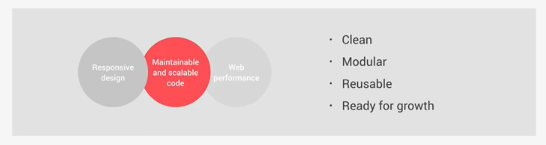

   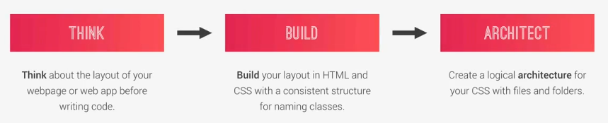

   ##### Thinking About The Layout

   ------

   

   1. Think

      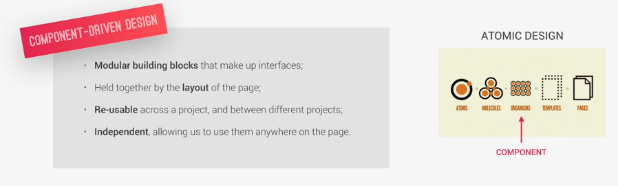

   2. Build

      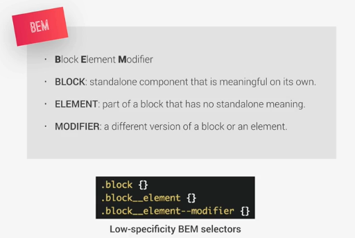

   3. Architect

      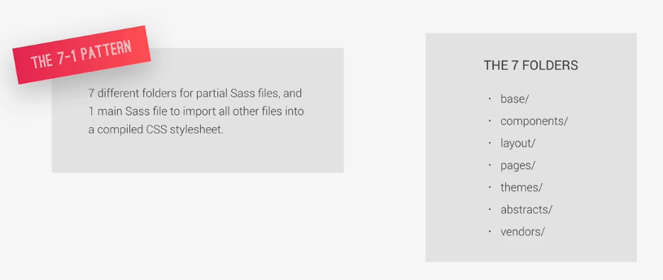

      Reference : [sass-guideline](https://sass-guidelin.es/#the-7-1-pattern)

## Introduction to Sass and NPM

1. #### What is SASS

   `Sass` is a CSS preprocessor, an extension of CSS that adds power and elegance to the basic language.

   ##### *How does it work?*

   ------

   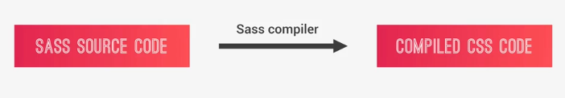

   We make **Sass Code** First, then it'll compile with the compiler to the original **Compiled CSS Code**.

   ##### *Main Sass Features*

   ------

   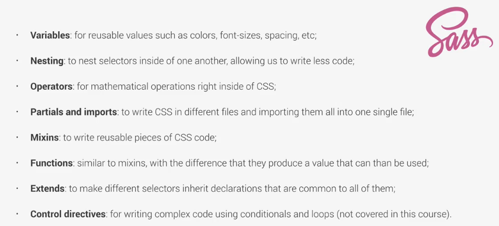

   

   ##### *SASS and CSS: Clearing Up The Confusion*

   ------

   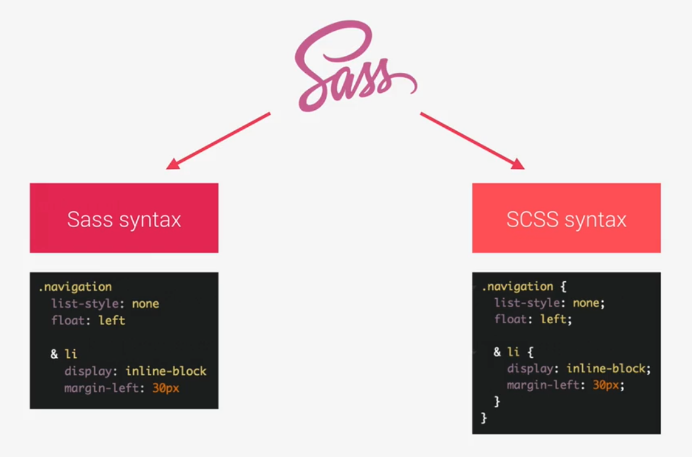

   Comparison between Sass and SCSS syntax :

   **Sass :** 

   * There are no `;` (Semicolons) and `{` (Curly Brackets). 
   * Have the .sass extension.

   **SCSS :**

   * There are `;` (Semicolons) and `{ ` (Curly Brackets) in every lines of code. Also almost have similiat syntax with basic CSS.
   * Have the .scss extension.

2. #### First Steps with Sass_ Variables and Nesting

   [Example SCSS Code](https://codepen.io/afandilham/pen/KYXzWw?editors=1100)

   ```scss
   // Example of Variables in SCSS Code
   $color-primary: #f9ed69; 
   $color-secondary: #f08a5d;
   $color-tertiary: #b83b5e;
   $color-text-dark: #333;
   $color-text-light: #eee;
   
   $width-button: 150px;
   
   // Example of Nested in SCSS Code
   .navigation {
       list-style: none;
       float: left;
     
     // It's Similiar with .navigation li {}
      li {
          display: inline-block;
          margin-left: 30px;
          
          &:first-child {
              margin: 0;
          }
          
          // It's similiar with .navigation li a:hover ()
          a:link {
              text-decoration: none;
              text-transform: uppercase;
              color: $color-text-dark; 
          }
       }
   }
   ```

   

3. #### First Steps with Sass_ Mixins_ Extends and Functions

   A mixin lets you make groups of CSS declarations that you want to reuse throughout your site. You can even pass in values to make your mixin more flexible. [1](https://sass-lang.com/guide)

   **DRY Principles : ** *Don't Repeat your code* [1](https://dzone.com/articles/is-your-code-dry-or-wet) [2](https://en.wikipedia.org/wiki/Don%27t_repeat_yourself) [3](https://dzone.com/articles/is-your-code-dry-or-wet)

   Example Code : [Codepen.io](https://codepen.io/afandilham/pen/KYXzWw?editors=1100)

   

4. #### A Brief Introduction to the Command Line

   If you want to learn about Command Line, you can get these free ebooks that i listed below. This is based on my experience and other people. I Started using Linux in 2015 :

   - [Linux Command Line](http://linuxcommand.org/tlcl.php) by William Shotts
   - [Linux Bible](https://udaygade.files.wordpress.com/2015/04/linux-bible-by-christopher-negus.pdf) by Christopher Negus
   - and you can also check this one [Itfoss](https://itsfoss.com/learn-linux-for-free/).

5. #### NPM Packages_ Let's Install Sass Locally

   ##### Introduction to NPM and The Node Ecosystem

   `NodeJS`  -->  Open Soure Javascript runtime to write and run Javascript Code and compile SCSS.

   `NPM` --> a simple command line interface that allows developer to install and manage packages. 

   ##### Summary

   ------

   `package.json` --> containt the definition of our project and where NPM will write the packages.

   Step to install `package.json` and  `node_modules` for compiling SCSS :

   1. First install NodeJS

   2. Move directory on Command Line to the project directory

   3. Type this command `npm init`. After that, the package.json must be on the project folder.

   4. The last you can install `npm install node-sass --save-dev`

      ```json
      /* package.json */
      
      {
        "name": "natours",
        "version": "1.0.0",
        "description": "Landing page for natours",
        "main": "index.js",
        "scripts": {
          "test": "echo \"Error: no test specified\" && exit 1"
        },
        "author": "ilham afandi",
        "license": "ISC",
        "devDependencies": {
          "node-sass": "^4.11.0"
        },
        "dependencies": {}
      }
      
      ```

      If we delete the `node_modules` folder and download again that modules. You only run this command `node install` and all of the dependencies will be install. Because the devDependencies has on the list of package.json file.

6. ##### NPM Scripts_ Let's Write and Compile Sass Locally

   Step to make SCSS file and Compile it. Also there are some tricks that helpfull for us.

   1. I Make Folder called scss and make file within it, with name `main.scss`.

   2. Copy all `style.css` code to `main.scss`. An did something in there. i.e make three variables and use them to the property that need it.

   3.  if you want to compile it, just edit `package.json` file. Type this in `scripts` --> `"compile:sass": "node-sass sass/main.SCSS css/style.css -w"` 

      |    Options     |                         Descriptions                         |
      | :------------: | :----------------------------------------------------------: |
      |  compile:sass  |       Name of the scripts than we will run in terminal       |
      |   node-sass    |                    The modul that we use                     |
      | sass/main.SCSS |                          input file                          |
      | css/style.css  |                         output file                          |
      |       -w       | watch (automatically update when there is changes in a file) |

   4. Run this command in terminal : `npm run compile:sass`. It will generate css code and replace the older one.

7. ##### The Easiest Way of Automatically Reloading a Page on File Changes

   **Global Installation ** --> install package that can use for all projects, not only particular project.

   install Live Server globally in the project --> `npm install live-server -g` 

   Type in the command line `live-server` to run automatically index.html file when there are some changes.

## Natours Project  Using Advanced CSS and Sass (Part 2)

1. #### Implementing the 7-1 CSS Architecture with Sass

   *7-1 pattern*: 7 folders, 1 file. Basically, you have all your partials stuffed into 7 different folders, and a single file at the root level. (usually named `main.scss`) which imports them all to be compiled into a CSS stylesheet.

   - `base/`

   - `components/`

   - `layout/`

   - `pages/`

   - `themes/`

   - `abstracts/`

   - `vendors/`

     And of course:

   - `main.scss`

   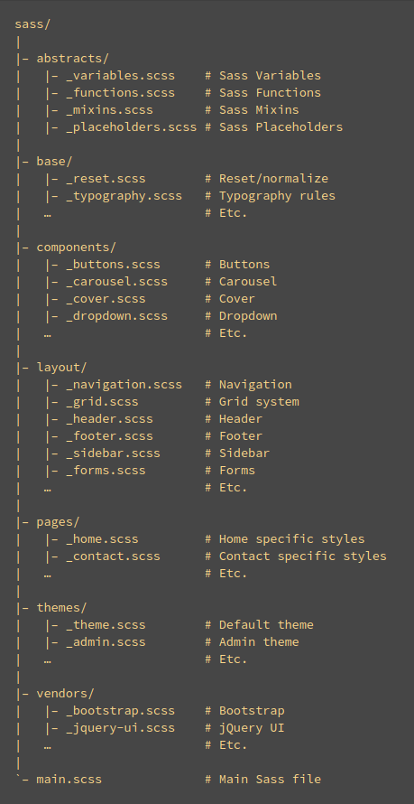

   Tips : If there are some related to typography, you probably change it to the the related one. You only move some of the code that related. This method not only for that, but for the code that related to the 7-1 patterns file.

   i.e : 

   ```scss
   /* main.scss */
   @import "abstracts/functions";
   @import "abstracts/mixins";
   @import "abstracts/variables";
   
   @import "base/animations";
   @import "base/base";
   @import "base/typography";
   @import "base/utilities";
   
   @import "components/button";
   
   @import "layout/header";
   
   @import "pages/home";
   
   // The body's code is related to typography
   body {
       font-family: "Lato", sans-serif;
       font-weight: 400;
       /* font-size: 16px; */
       line-height: 1.7;
       color: $color-grey-dark;
       padding: 3rem;
   	
       // except this one
       box-sizing: border-box; 
   }
   ```

   The result is : 

   ```scss
   // base/_typography.scss
   body {
       font-family: "Lato", sans-serif;
       font-weight: 400;
       /* font-size: 16px; */
       line-height: 1.7;
       color: $color-grey-dark;
       padding: 3rem;
   }
   ```

   ```scss
   // base/_base.scss
   body {
       box-sizing: border-box;
   }
   ```

   

2. #### Review_ Basic Principles of Responsive Design and Layout Types

   **Review: Basic Responsive Design Principle**

   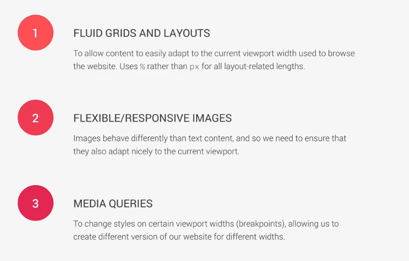

   Other Reference : [medium.com](https://medium.com/@space.alpaca/so-what-exactly-is-the-difference-between-fixed-fluid-adaptive-and-responsive-layouts-and-why-3773272d8481) 

3. #### Building a Custom Grid with Floats

   *Lecture :*

   * Architect and build a simple grid system
   * How the attribute Selector works
   * How the `:not` pseudo-class works
   * How `calc()` works, and what's the difference between `calc()` and simple Sass operations.

   #### Summary

   ------

   `calc()` --> is used for doing some calculations in SCSS.

   i.e :

   ```scss
   .col-1-of-2 {
       /* 
       	If we're using varible, make sure that you give curly brackets followed by
       	# hastag symbol --> #{$variable}
       */ 
       width: calc((100% - #{$gutter-horizontal}) / 2)
   }
   ```

   `display: table;` --> standart value of clear fix.

   `[class^=name-]` --> select all of the class attribute with the name 'name-' in the beginning.

   `[class$=name-]` --> select all of the class attribute with the name 'name' in the end.

   `[class*=name-]` --> select any classes which contains part of 'name-'.

4. #### Building the About Section - Part 

   *Lecture :*

   * Thinking about components
   * How and Why to use utility classes
   * how to use the `background-clip` properties
   * `transform` multiple properties simultaneously
   * How to use the `outline-offset` property together with `outline`
   * Style elements that are NOT hovered with others are.

   ##### Summary

   ------

   `-webkit-background-clip: text;` --> background  gets clipped exactly where the text is,  it will clip the background, and only visible the `text`.

   `color: transparent;` --> Make the font transparent.

   `skew()` --> The`skew()` [CSS](https://developer.mozilla.org/en-US/docs/Web/CSS) function defines a transformation that skews an element on the 2D plane. Its result is a `transform-function` data type. [1](https://developer.mozilla.org/en-US/docs/Web/CSS/transform-function/skew)  [2](https://developer.mozilla.org/en-US/docs/Web/CSS/background-clip)

   Utility Classes --> Simple classes in css, which only have one simple goal.

   `outline` --> Borders and outlines are very similar. However, outlines differ from borders in the following ways:

   * Outlines never take up space, as they are drawn outside of an element's content.
   * According to the spec, outlines don't have to be rectangular, although they usually are. [1](https://developer.mozilla.org/en-US/docs/Web/CSS/outline)

   ```scss
   /* style */
   outline: solid;
   
   /* color | style */
   outline: #f66 dashed;
   
   /* style | width */
   outline: inset thick;
   
   /* color | style | width */
   outline: green solid 3px;
   ```

   `outline-offset` --> CSS property sets the amount of space between an outline and the edge or border of an element.

5. #### Building the Features Section

   *Lecture :*

   - Include and use an icon font
   - Another way of creating the "skewed section" design 
   - How and when to use the direct child selector

   ##### Summary

   ------

   `persective ` --> property determines the distance between the z=0 plane and the user in order to give a 3D-positioned element some perspective. Each 3D element with z>0 becomes larger; each 3D-element with z<0 becomes smaller. The strength of the effect is determined by the value of this property. [1](https://developer.mozilla.org/en-US/docs/Web/CSS/perspective)

   `background-blend-mode` --> property defines how an element's `background-image` should blend with its `background-color.

   Example :

   ```css
   .container {
     background-image: url('image.jpg');
     background-color: red;
     background-blend-mode: screen;
   }
   ```

   Reference : [link](https://css-tricks.com/almanac/properties/b/background-blend-mode/)

6. #### Building the Stories Section

   *Lecture :*

   * How to make flow around shaped with `shape-outside` and `float`
   * How to apply a `filter` to images
   * Create a background video convering an entire section
   * Use the `<video>` HTML element
   * How and when to use the `object-fit` property 

   ##### Summary

   ------

   `shape-outside` --> property controls how content will wrap around a floated element’s bounding-box. Typically this is so that text can reflow over a shape such as a circle, ellipse or a polygon.[1](https://css-tricks.com/almanac/properties/s/shape-outside/) 

   ```css
   .element {  
     float: left;
     shape-outside: circle(50%);
     width: 200px;
     height: 200px;
   }
   ```

   `circle()` --> used to define a circle.[2](https://tympanus.net/codrops/css_reference/circle/)

   ```css
   circle(); 
   /* use default values: circle with closest-side radius,
   positioned at the center of the element */
   
   circle(100px at 30% 50%);
   /* circle of radius 100px positioned at 30% horizontally
   and 50% vertically */
   
   circle(farthest-side at 25% 25%);
   /* defines a circle whose radius is half the length of
   the longest side, positioned at the point of
   coordinates 25% 25% on the element’s coordinate system */
   
   circle(10em at 500px 300px);
   /* defines a circle whose center is positioned at 500px
   horizontally and 300px vertically, with a radius of
   10em */
                   
   ```

7. #### Building the Booking Section 

   *Lecture :*

   * How to implement "solid-color-gradients"
   * General and adjacent sibling selectors work and why need them
   * How to use the `::input-placeholder` pseudo-element
   * How and when to use the `:focus`, `:invalid`, `placeholder-shown`, and `:checked` pseudo-classes
   * Techniques to build custom radio buttons.

   ##### Summary

   ------

   solid-color-gradients --> Using gradient in Background image.

   ```scss
   background-image: linear-gradient(105deg, 
           rgba($color-white, .9) 0%,
           rgba($color-white, .9) 50%,
           transparent 50%) ,
       url(../img/nat-10.jpg);
   ```

   `:focus` --> represents an element (such as a form input) that has received focus. It is generally triggered when the user clicks or taps on an element or selects it with the keyboard's "tab" key.[1](https://developer.mozilla.org/en-US/docs/Web/CSS/:focus)

   `:placeholder-shown` -->  Represents any `<input>` or `<textarea>` element that is currently displaying placeholder text. 

8. #### Building the Navigation 

   *Lecture :*

   * What the "Checkbox hack" is and how it works
   * Create custom animation timing funciton using cubic bezier curves
   * Animate "solid-color-gradients"
   * How and why to use `transform-origin` 
   * In general: create an amazingly creative effect!

   ##### Summary

   ------

   `radial-gradient()` --> Similiar with `linear-gradient` but start in the center of element and goes to all the outside direction.

9. #### Building a Pure CSS Popup 

   * How to build a nice popup with only CSS
   * User the `:target` pseudo-class
   * Create boxes with equal height using `display: table-cell`
   * Create CSS text columns
   * Automatically hyphenate words using `hyphens`

   ##### Summary 

   ------

   `display: table-cell` --> Let the element behave like a `<td>` element and must added `display: table` to the parent element.

   `vertical-align` --> property in CSS controls how elements set next to each other on a line are lined up. [1](https://css-tricks.com/almanac/properties/v/vertical-align/)  

   `columns` -->  It’s like taking a newspaper, but as the paper gets smaller, the columns will adjust and balance automatically allowing the content to flow naturally. [1](https://css-tricks.com/almanac/properties/c/columns/) 

   `hyphens` --> property controls hyphenation of text in block level elements. You can prevent hyphenation from happening at all, allow it, or only allow it when certain characters are present. [1](https://css-tricks.com/almanac/properties/h/hyphenate/) 

   `target` --> applies the element which is the target when we click the button or something else.

10. 

    

